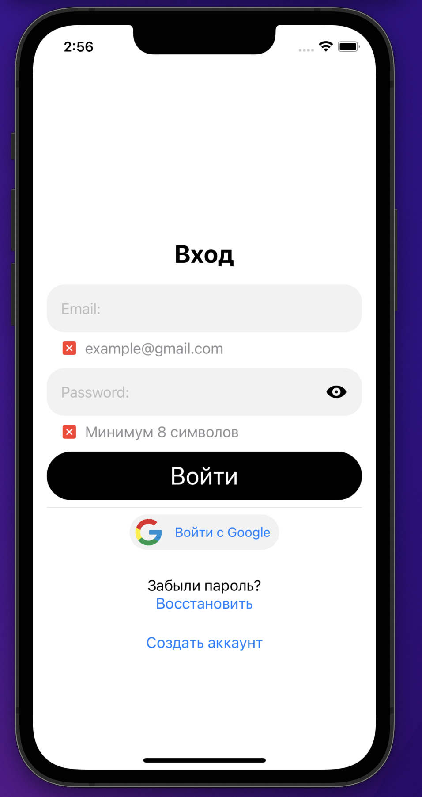
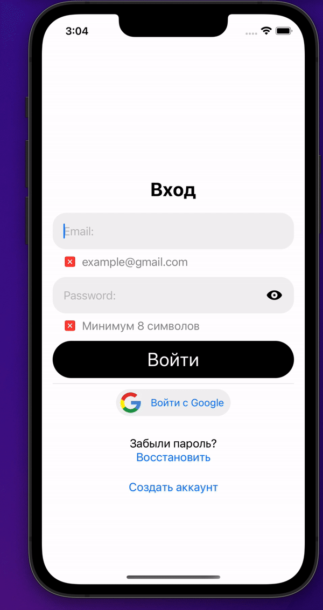
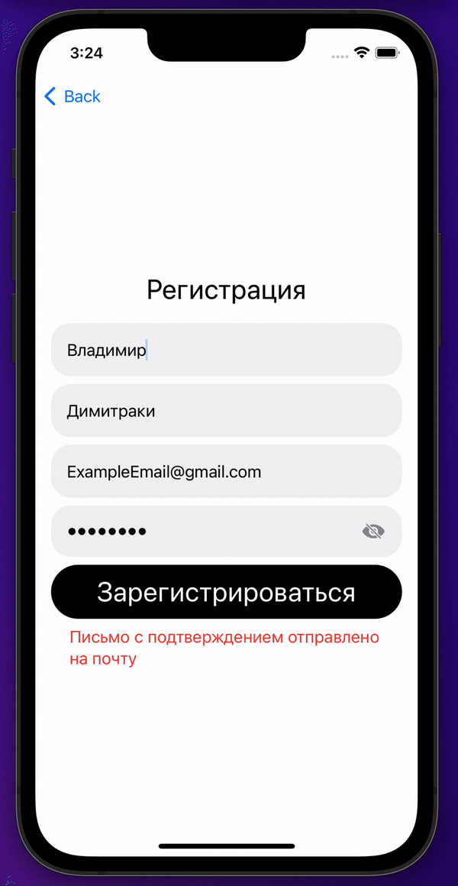
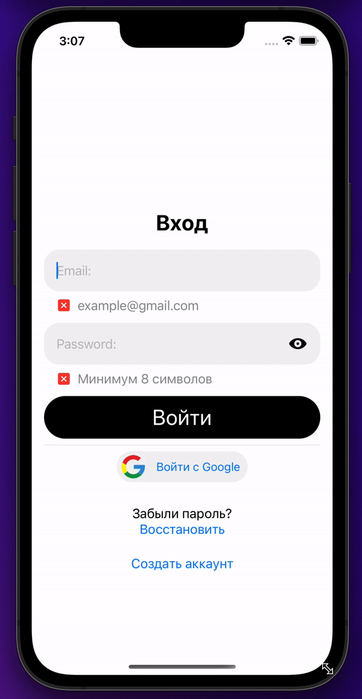

# iOS app with using Firebase and Google SignIn SDK 

iOS приложение, цель которого познакомится с Firebase, и Google sign in SDK

> Используемые технологии: 
SwiftUi, Combine, Firebase, Google SignIn SDK, архитектура MVVM. 

В приложении реализованы 3 экрана

>1. Экран аутентификации

> Возможность входа с Google аккаунта

> 2. Экран регистрации

> 3. Экран восстановления пароля

 
